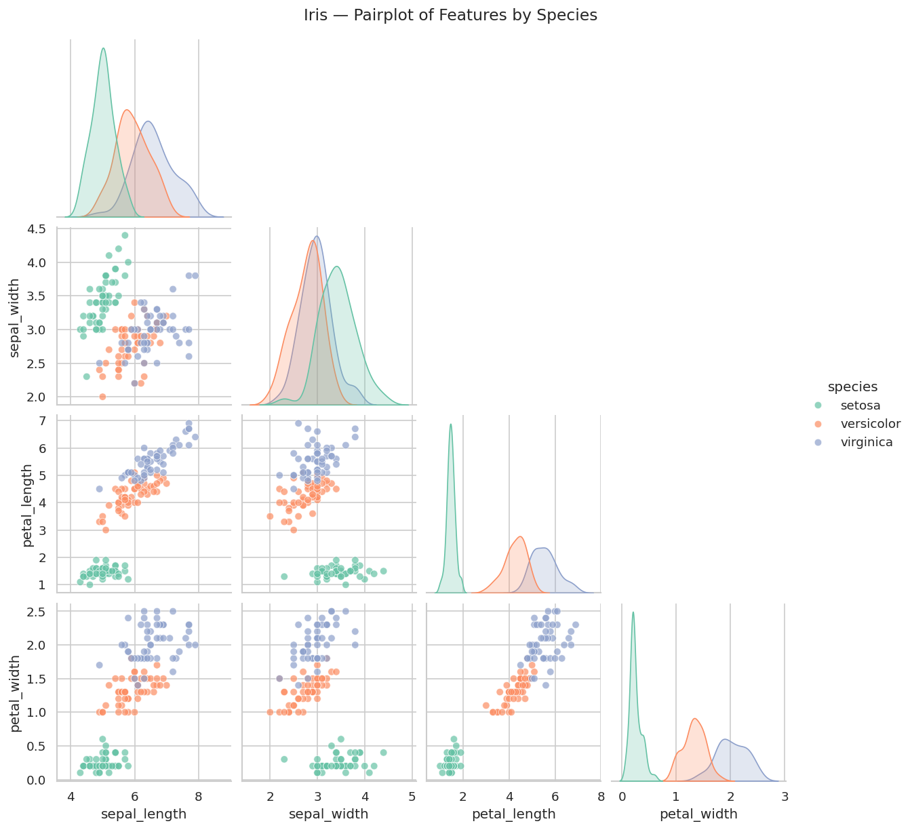
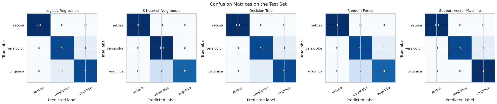
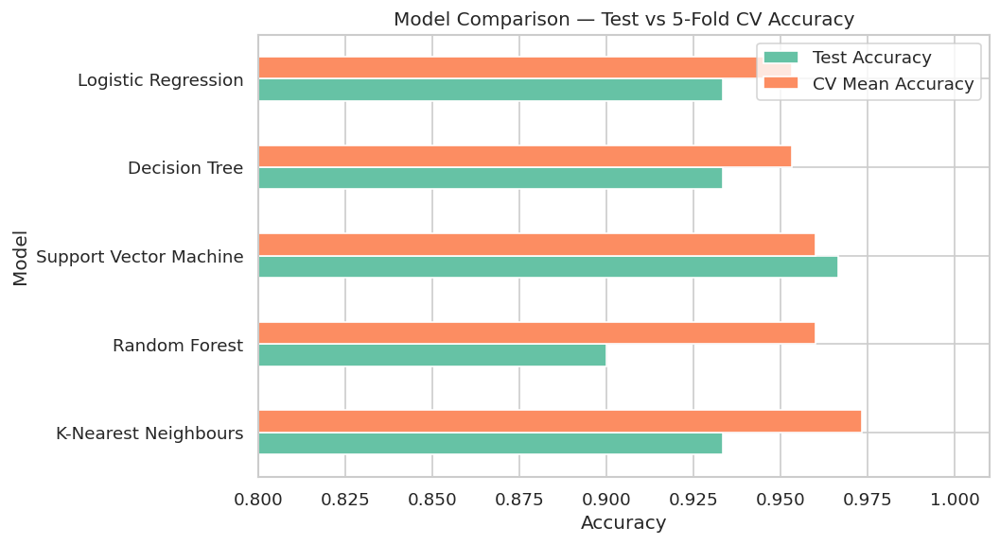

# 🌸 Task 1 · Iris Flower Classification

**Oasis Infobyte Internship (OIBSIP) · Data Science Track** · Vinay Singh Chaudhary

 

## 🎯 Objective
Train a machine-learning classifier that identifies an iris flower's species — *Setosa*, *Versicolor* or *Virginica* — from sepal and petal measurements.

## 📦 Dataset
Iris dataset (150 samples, 4 features, 3 balanced classes) loaded directly with `sklearn.datasets.load_iris()` — no download needed.

## 🛠️ Tech stack
Python · pandas · NumPy · matplotlib · seaborn · scikit-learn · Jupyter

## 🧭 Approach
1. EDA — shape, dtypes, null check, descriptive statistics, class balance
2. Visualisation — pairplot by species, box plots, correlation heatmap
3. Feature-selection discussion — correlation, ANOVA F-score and Random-Forest importance
4. Stratified 80/20 train/test split; scaling inside pipelines (no leakage)
5. 5 classifiers — Logistic Regression, KNN, Decision Tree, Random Forest, SVM
6. Evaluation — accuracy, confusion matrices, classification reports, 5-fold cross-validation
7. Best-model declaration + live prediction for new flowers

## 🏆 Results
| Model | Test accuracy | 5-fold CV accuracy |
|-------|:-------------:|:------------------:|
| **K-Nearest Neighbours** 🏆 | 93.3 % | **97.3 %** |
| Support Vector Machine | 96.7 % | 96.0 % |
| Random Forest | 90.0 % | 96.0 % |
| Decision Tree | 93.3 % | 95.3 % |
| Logistic Regression | 93.3 % | 95.3 % |

**Why KNN?** The test set has only 30 flowers (1 error = 3.3 %), so the model is chosen on the more reliable cross-validated accuracy.
**Petal length & width** are the most discriminative features (~87 % of RF importance); all errors are Versicolor ↔ Virginica.

## 🖼️ Visual highlights
| **Pairplot by species** |
|:--:|
|  |

| **Confusion matrices** |
|:--:|
|  |

| **Model comparison** |
|:--:|
|  |

## 📁 Files
| File | Description |
|------|-------------|
| `VinaySinghChaudhary_Task1.ipynb` | Complete, commented and executed notebook |
| `outputs/` | All charts saved as PNG |

---

## ▶️ How to run
```bash
# from the OIBSIP root folder
pip install -r requirements.txt
cd DataScience-Task1-IrisFlowerClassification
jupyter notebook VinaySinghChaudhary_Task1.ipynb
```
Then choose **Kernel ▸ Restart & Run All**. Every chart is displayed in the notebook and saved to `outputs/`.

## 🎥 Demo
📺 LinkedIn demo video: *link will be added after posting*

---
<sub>Part of my <a href="../">OIBSIP repository</a> · Oasis Infobyte Data Science Internship · Vinay Singh Chaudhary · #oasisinfobyte</sub>
